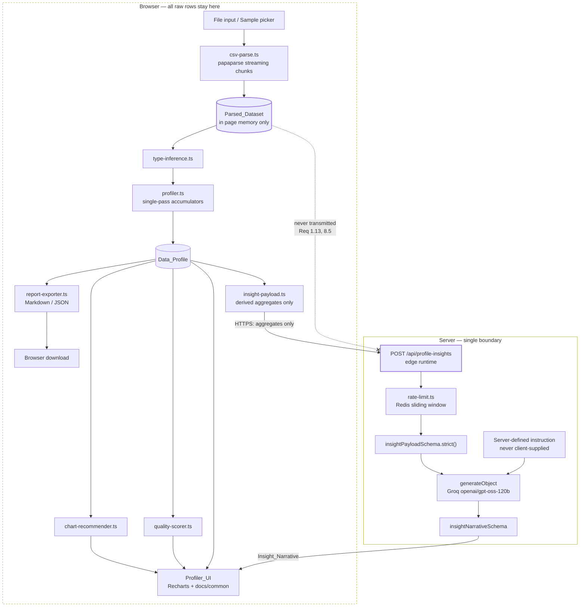
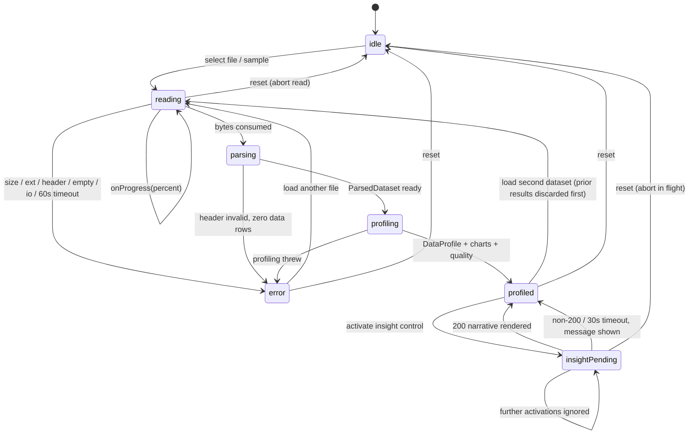

# Design Document

## Overview

The CSV Data Profiler is a client-side analysis playground mounted at `/playground/data-profiler`. A visitor supplies CSV data (upload or bundled sample), the browser parses it, derives a full statistical profile, recommends and renders charts from that profile, scores data quality, optionally requests an AI narrative, and exports the result as Markdown or JSON.

The defining architectural property is that **raw rows never leave the browser**. There is exactly one server boundary — `POST /api/profile-insights` — and it accepts only derived aggregates validated against a `.strict()` Zod schema. Because the payload has no free-text field and no cell values beyond truncated aggregate extrema, prompt injection is removed by construction rather than by filtering. This is the inverse of the existing `/api/chat` route, which must defend against injection with `lib/query-validator.ts`; that contrast is itself a portfolio talking point and is surfaced in the page's explanation section (Requirement 9.3).

### Research and Decision Summary

| Question | Decision | Rationale |
|---|---|---|
| CSV parsing | `papaparse` streaming `chunk` mode over the `File` object | RFC 4180 quoting/escaping is the classic place hand-rolled parsers break. Papaparse exposes a byte `cursor` per chunk, which is exactly what Requirement 1.8 needs for a percentage indicator. |
| Papaparse `worker: true`? | No | Worker mode resolves its own script path at runtime, which is fragile under Turbopack bundling. Streaming chunk callbacks already yield the main thread between chunks. |
| Dedicated Web Worker for profiling? | No — see [Performance](#performance-approach) | Structured-cloning up to 10M cells into a worker costs more than the single pass itself. Time-slicing per chunk keeps the UI responsive and makes abort (Requirement 8.7) trivial. |
| Charting | `recharts` | It is the library Shadcn's own chart primitives wrap, so it fits the "Shadcn for primitives" rule, is React-declarative (no imperative canvas), and supports `isAnimationActive={false}` for Requirement 9.6. |
| AI call shape | `generateObject` from `ai` v5 with a Zod schema | Requirement 6.8 needs a *validated structured* narrative, not a token stream. `streamText` (used by `/api/chat`) cannot enforce a schema. |
| Rate limiting | `@upstash/redis` sorted-set sliding window | Already a project dependency and already the session store. A sorted set gives the exact "time remaining until next request is permitted" value Requirement 6.10 requires. |
| Testing | `vitest` + `fast-check` | No test framework exists yet. The profiling core is pure and numeric — the ideal PBT target. |

---

## Design System Constraints

The user asked that this design respect the project's existing design rules. Constraints extracted from `docs/agents.md`, `agents.md`, `claude.md`, `docs/agent-edit-mode.md`, `docs/agent-designer-mode.md`, `docs/dev-traits/traits.md`, `docs/dev-traits/security.md`, and `docs/font_design_guide.md`, and how this design honors each:

### Honored — Styling and Typography

| Rule (source) | How this design complies |
|---|---|
| Never hardcode hex values; use CSS variables / Tailwind theme (designer-mode Anti-Patterns) | Every surface uses only tokens that exist in `app/globals.css`: `background`, `foreground`, `card`, `primary`, `secondary`, `muted`, `muted-foreground`, `accent`, `destructive`, `border`, `line-strong`, `dot`, `input`, `ring`, `chart-1`…`chart-5`. Recharts colors are read as `var(--chart-1)`…`var(--chart-5)`, not literals. No new token is invented. |
| Ndot is display-only — brand hero, index numbers, loading percentages (`globals.css` header, `font_design_guide.md`) | `.nm-display` / `.font-ndot` is used **only** for the parse-progress percentage, the Quality_Score numeral, and section index numerals. Never for column names, statistics tables, or prose. |
| NType82 for headings and labels | Section titles inherit `h2`/`h3` (already NType82 via `@layer base`). All small labels use `.nm-label` / `.nm-label-sm`. |
| LetteraMono for mono/code | `font-mono` for CSV field values, JSON snippets, and `CodeBlock` content only. |
| Inter for body copy | Default; no override. |
| Tabular figures for numeric columns (`font_design_guide.md` §3) | The Column_Profile statistics table and `MetricCard` use `tabular-nums` so decimals align — `MetricCard` already does this. |
| Thin hairline borders, no elevation/shadows | Reuse `border-border` / `border-line-strong` panel patterns from `docs/common`; no `shadow-*`. |
| Tailwind classes only — no CSS modules, styled-components, inline styles | All styling is Tailwind utility classes plus the existing `nm-*` utilities. |
| Dark mode always supported | Only semantic tokens are used, so both `:root` and `.dark` blocks resolve automatically. No `dark:` hex pairs needed. |
| Mobile-first responsive | Single-column base layout, `sm:`/`md:` upgrades. Satisfies Requirement 9.5. |
| Framer Motion for interactive animation, not raw `@keyframes` | Chart mount transitions and panel enter/exit use Framer Motion. See the [conflict note](#conflicts-and-deviations) about Requirement 9.6. |
| Lucide React only for icons | `Upload`, `FileText`, `Sparkles`, `Download`, `RotateCcw`, `AlertTriangle`, `TriangleAlert` from `lucide-react`. |

### Honored — Structure and Reuse

| Rule (source) | How this design complies |
|---|---|
| Golden Rule: no repeated markup; audit before creating (`traits.md` §0) | Full audit performed against `components/ui/` (8 primitives), `components/docs/common/` (15 exports), `components/ai-chat/`, `components/sections/`. Reuse map in [Component Reuse Audit](#component-reuse-audit). Exactly one new shared primitive is proposed, with justification. |
| All business logic in `lib/`, never in components (`claude.md` rule 4, `agents.md` rule 9) | All parsing, inference, statistics, recommendation, scoring, payload construction and serialization live under `lib/data-profiler/`. Components render and dispatch only. |
| `lib/` kebab-case files, camelCase exports (`traits.md` §1) | `type-inference.ts` → `inferColumnTypes()`, `quality-scorer.ts` → `scoreQuality()`, etc. |
| Types/Interfaces PascalCase; constants UPPER_SNAKE_CASE; Zod schemas camelCase + `Schema` suffix | `DataProfile`, `ROW_CAP`, `insightPayloadSchema`. |
| `@/` alias, never relative imports across directories | All cross-directory imports use `@/lib/...`, `@/components/...`, `@/data/...`. |
| Components PascalCase, one per file; UI primitives kebab-case file | `components/playground/data-profiler/IntakePanel.tsx` style is *not* used — this project uses kebab-case files for `ui/` and PascalCase files only under `components/docs/`. New domain components follow the `components/ai-chat/` precedent: kebab-case files, PascalCase exports. |
| API routes lowercase `route.ts` (`traits.md`) | `app/api/profile-insights/route.ts`. |
| Page pattern: `page.tsx` wraps a `content.tsx` in `Suspense` (`app/docs/page.tsx`) | `app/playground/data-profiler/page.tsx` (server, metadata + Suspense skeleton) → `content.tsx` (`"use client"`). |
| No bare `fetch` in components; use server actions or API routes (`docs/agents.md` rule 11) | The single client→server call is wrapped in `lib/data-profiler/insight-client.ts`. Sample CSV loading is wrapped in `lib/data-profiler/sample-loader.ts`. No component calls `fetch` directly. |
| Zod validation on every API route (`security.md` §2) | `insightPayloadSchema.strict()` on the request, `insightNarrativeSchema` on the model result. |
| Secrets server-only, never `NEXT_PUBLIC_` (`security.md` §4) | `GROQ_API_KEY`, `UPSTASH_REDIS_REST_URL`, `UPSTASH_REDIS_REST_TOKEN` are read only inside the route handler. |
| Error messages must not leak internals (`security.md` §7) | The route returns fixed messages; the failing field name for a 400 is a schema path (e.g. `columns[3].name`), never a stack trace. |
| Groq only, model `openai/gpt-oss-120b` (`agents.md`, `claude.md` rule 1) | `createGroq()` + `generateObject({ model: groq('openai/gpt-oss-120b') })`. No direct OpenAI call. |
| Edge runtime for AI routes (`docs/agents.md` rule 16) | `export const runtime = 'edge'` — `@ai-sdk/groq` and `@upstash/redis` are both REST-based and Edge-safe. No Node-only imports. |
| pnpm only; pin deps exactly like `zod: "3.25.76"` | Exact pins listed in [Dependencies](#new-dependencies). Install commands use `pnpm add`. |
| `pnpm run build` then `pnpm run start` must pass after every change | Stated in the [Testing Strategy](#testing-strategy) as the gate for every task. |
| Never `dangerouslySetInnerHTML` (`security.md` §3) | The AI narrative and all CSV-derived strings render as JSX text children, auto-escaped. The Markdown export is generated as a string for download only — never parsed and injected into the DOM. |

### Conflicts and Deviations

Five places where a requirement collides with a project rule, another requirement, or a stack fact. Each is called out rather than silently resolved.

1. **`agents.md` says "use next js 15"; the project is on `next@16.0.10`.** The repo state wins. No design element depends on a 15-only API. Worth updating `agents.md`, out of scope here.
2. **`agents.md` says "always npm run build / npm run start" while `claude.md` and `docs/agents.md` mandate pnpm.** pnpm wins — it is the rule in both newer documents and matches `pnpm-lock`/`.npmrc`.
3. **"Framer Motion for animations, no raw CSS animations" vs. Requirement 9.6 (zero animation under reduced-motion).** Resolved without breaking either rule: `useReducedMotion()` from `framer-motion` gates every `motion.*` transition to `{ duration: 0 }` and sets Recharts `isAnimationActive={false}`. The existing `nm-reveal` / `nm-pulse` CSS utilities are **not** used on this page, since they cannot be conditionally disabled from React.
4. **Requirement 9.2 mandates reuse of `components/docs/common`, but `traits.md` §0 says audit `components/ui/` first.** Requirement 9.2 is the narrower instruction and is followed. `components/docs/common` is presentational and route-agnostic (no `/docs` coupling), so reusing it from `/playground` introduces no cross-feature dependency problem. Shadcn primitives from `components/ui/` are still used for `Button`, `Select`, and `Card`.
5. **Requirement 4.10 conflicts with Requirements 2.2 and 4.2.** A `numeric` column may contain up to 5% non-numeric non-null values, which cannot be assigned to a bin, so bin counts cannot always sum to the non-null count while `binCount` stays as 4.2 defines it. Resolved with an explicit `unbinnableCount` field — full reasoning in [Histogram Binning](#histogram-binning). This is the one place the design cannot satisfy a criterion exactly as written, and it needs a requirements decision.

One further note: `docs/agents.md` rule 6 ("mood compliance is mandatory") and rule 4 ("validate queries before RAG") apply to the digital-twin chat persona. They do **not** apply to `/api/profile-insights`, which has no persona, no visitor text, and no RAG retrieval. Applying `query-validator.ts` here would be meaningless — there is no query to validate. This is a deliberate scoping decision, not an oversight.

---

## Architecture

### Data Path



### Route and Layout Composition

```
app/playground/layout.tsx              — "use client"; header + ThemeToggle, mirrors app/docs/layout.tsx minus DocsSidebar
app/playground/data-profiler/page.tsx  — server component; metadata + <Suspense> skeleton (docs/page.tsx pattern)
app/playground/data-profiler/content.tsx — "use client"; composes panels, owns the state machine hook
app/api/profile-insights/route.ts      — edge runtime; POST only
```

`page.tsx` renders the same pulse-skeleton fallback shape as `app/docs/page.tsx` (`h-8` + `h-64` `bg-muted animate-pulse`) so the loading state is visually consistent with the rest of the site.

### Module Breakdown

| File | Purity | Responsibility | Requirements |
|---|---|---|---|
| `lib/data-profiler/types.ts` | types only | Every interface in [Data Models](#data-models) | — |
| `lib/data-profiler/constants.ts` | pure | `ROW_CAP`, `SIZE_CAP_BYTES`, `TYPE_THRESHOLDS`, `QUALITY_WEIGHTS`, `MAX_*` caps | 1.3, 1.7, 2.x, 5.2 |
| `lib/data-profiler/csv-parse.ts` | **impure** (File IO) | `parseCsvFile(file, handlers, signal)` → `ParsedDataset`; row cap, ragged-row issues, byte progress, 60s guard | 1.3, 1.6–1.11, 1.14, 1.15 |
| `lib/data-profiler/csv-serialize.ts` | pure | `serializeDataset()` — RFC 4180 quoting; used by the round-trip property and nothing else in prod | 1.12 |
| `lib/data-profiler/sample-loader.ts` | impure (static GET) | `loadSampleDataset(id)` → CSV text from `public/samples/` | 1.1, 1.2 |
| `lib/data-profiler/values.ts` | pure | `isNullish()`, `parseFiniteNumber()`, `parseAcceptedDate()` | 2.2, 2.3, 2.11, 3.5 |
| `lib/data-profiler/type-inference.ts` | pure | `inferColumnTypes(dataset)` → `ColumnType[]` | 2.1–2.12 |
| `lib/data-profiler/stats.ts` | pure | `quantile()`, `mean()`, `stdDev()`, `pearson()`, `round6()` | 3.3, 3.7 |
| `lib/data-profiler/profiler.ts` | pure | `profileDataset(dataset, types)` → `DataProfile` | 3.1–3.15 |
| `lib/data-profiler/chart-recommender.ts` | pure | `recommendCharts(profile)` → `ChartSpec[]` | 4.1–4.5, 4.10, 4.11 |
| `lib/data-profiler/quality-scorer.ts` | pure | `scoreQuality(profile)` → `QualityResult` | 5.1–5.6, 5.8, 5.9 |
| `lib/data-profiler/insight-schema.ts` | pure | `insightPayloadSchema`, `insightNarrativeSchema` — imported by both client and route | 6.2–6.5, 6.8 |
| `lib/data-profiler/insight-payload.ts` | pure | `buildInsightPayload(profile, quality)` — truncation and caps | 6.2, 6.3 |
| `lib/data-profiler/insight-client.ts` | impure (fetch) | `requestInsights(payload, signal)` — 30s timeout, status mapping | 6.1, 6.11, 6.13 |
| `lib/data-profiler/report-exporter.ts` | pure | `toMarkdownReport()`, `toJsonReport()` → `string` | 7.1–7.4, 7.6 |
| `lib/data-profiler/download.ts` | impure (DOM) | `triggerDownload(filename, mime, text)` — Blob + object URL, revoked in `finally` | 7.1, 7.2, 7.5, 7.8 |
| `lib/data-profiler/use-profiler.ts` | hook | The state machine in [Client State Machine](#client-state-machine); the only stateful piece | 1.x, 8.x |
| `lib/rate-limit.ts` | impure (Redis) | `checkRateLimit(key, limit, windowMs)` → `{ allowed, retryAfterMs }` | 6.10 |

`lib/` today is flat (`rag-utils.ts`, `session-memory.ts`, …), but this feature adds 17 modules. A `lib/data-profiler/` subdirectory keeps the flat convention readable rather than tripling the size of `lib/`'s root. `lib/rate-limit.ts` stays at the root because it is feature-agnostic and reusable by `/api/chat` later.

**Purity convention.** Existing `lib/` modules already split this way — `query-validator.ts` and `feedback-detector.ts` are pure functions over their inputs, while `session-memory.ts` and `rag-utils.ts` own the IO. This design follows the same split: all nine analysis modules are total, deterministic functions with no `Date.now()`, no `Math.random()`, and no DOM access, which is what makes the property tests possible. The four impure modules (`csv-parse`, `sample-loader`, `insight-client`, `download`) are thin adapters.

### Component Reuse Audit

Reused from `components/docs/common/` (Requirement 9.2):

| Component | Used for |
|---|---|
| `DocPageLayout` | Page header — title, subtitle, `index="01"` numeral |
| `DocSection` | Every top-level block: Intake, Profile, Charts, Quality, Insights, Export, How it works |
| `MetricGrid` / `MetricCard` | Dataset summary (retained rows, total rows, columns, duplicates) and the four quality penalty factors — already `tabular-nums` |
| `AlertBox` | Parse issues (`warning`), read/profile failures (`error`), row-cap notice (`info`) |
| `HighlightBox` | The "aggregates only, raw rows stay in your browser" statement required by 6.15 |
| `Tabs` | Explanation section: Type inference / Outliers / Quality weights / Privacy (Requirement 9.3) |
| `CodeBlock` | The literal `Insight_Payload` shape shown in the explanation section |
| `StepList` | Pipeline walkthrough in the explanation section |
| `ComparisonGrid` | "Injection-filtering vs. derived-data-only" contrast against `/api/chat` |
| `TroubleshootCard` | Cleaning recommendation rendering (column + issue + action maps onto it directly) |

Reused from `components/ui/`: `Button` (all controls, gives keyboard activation and focus ring for 9.4), `Select` (sample picker), `Card` (chart containers).

**One new shared primitive:** `components/ui/progress-bar.tsx` → `ProgressBar`. Nothing in `components/ui/` renders a determinate bar, and it is needed in two places — parse progress (1.8) and the Quality_Score meter (5.7). Two usages is exactly the `traits.md` §0 extraction threshold, so it belongs in `components/ui/`, token-only (`bg-secondary` track, `bg-primary` fill), with `role="progressbar"` and `aria-valuenow/min/max`.

New domain components under `components/playground/data-profiler/` (kebab-case files, PascalCase exports, matching `components/ai-chat/`):

`intake-panel.tsx`, `parse-progress.tsx`, `profile-summary.tsx`, `column-profile-table.tsx`, `correlation-list.tsx`, `chart-grid.tsx`, `chart-card.tsx`, `chart-text-alternative.tsx`, `quality-panel.tsx`, `insight-panel.tsx`, `export-controls.tsx`, `profiler-explainer.tsx`.

Each is presentational: props in, JSX out, callbacks up. `chart-card.tsx` is the only one with branching logic (chart type → Recharts element), and it is a pure switch over `ChartSpec.kind`.

---

## Components and Interfaces

### Intake

```ts
// lib/data-profiler/constants.ts
export const ROW_CAP = 50_000;
export const SIZE_CAP_BYTES = 5 * 1024 * 1024;
export const READ_TIMEOUT_MS = 60_000;
export const INSIGHT_TIMEOUT_MS = 30_000;
export const MAX_PROFILE_COLUMNS = 200;
export const MAX_INFER_ROWS = 100_000;
export const MAX_INFER_COLUMNS = 100;
export const MAX_CORRELATION_COLUMNS = 30;
export const MAX_TOP_VALUES = 10;
export const MAX_HISTOGRAM_BINS = 30;
export const MAX_CHART_SPECS = 12;
export const MAX_RENDERED_RECOMMENDATIONS = 100;
export const CHART_TEXT_ALT_VALUE_LIMIT = 30;
```

```ts
// lib/data-profiler/csv-parse.ts
export interface ParseHandlers {
  onProgress(percent: number): void;   // whole number 0..100, throttled to <=500ms — Req 1.8
}

export type ParseRejection =
  | { kind: 'size';      sizeMb: string; capMb: number }   // Req 1.4
  | { kind: 'extension' }                                   // Req 1.5
  | { kind: 'empty' }                                       // Req 1.9
  | { kind: 'header'; reason: 'no-fields' | 'empty-name' | 'duplicate-name' } // Req 1.15
  | { kind: 'read';     reason: 'io' | 'timeout' };          // Req 1.14

export type ParseOutcome =
  | { ok: true;  dataset: ParsedDataset }
  | { ok: false; rejection: ParseRejection };

export function parseCsvFile(
  file: File,
  handlers: ParseHandlers,
  signal: AbortSignal,
): Promise<ParseOutcome>;

export function parseCsvText(text: string, sourceName: string): ParseOutcome;
```

Rejections are a discriminated union rather than thrown errors so the UI can map each case to its required message without string matching — the same shape `validateQuery()` uses with its `errorType` field.

### Insight Service

```ts
// app/api/profile-insights/route.ts
export const runtime = 'edge';
export const dynamic = 'force-dynamic';
export async function POST(req: Request): Promise<Response>;
```

Handler order, mirroring `/api/chat`'s guard-first structure:

1. Env guard (`GROQ_API_KEY`, `UPSTASH_REDIS_REST_URL/TOKEN`) → 500, generic message.
2. `checkRateLimit()` → 429 with limit and `retryAfterMs` (Requirement 6.10); Redis unreachable → 503.
3. `insightPayloadSchema.strict().safeParse(body)` → 400 naming `error.issues[0].path` (Requirement 6.6). **No model request is issued.**
4. `generateObject({ model, schema: insightNarrativeSchema, system: INSIGHT_INSTRUCTION, prompt: JSON.stringify(parsed.data) })`.
5. `generateObject` throwing or returning a schema-invalid object → 502, no partial content (Requirement 6.9).
6. 200 `{ narrative }`.

`INSIGHT_INSTRUCTION` is a module-level `const` in the route file. Exactly two inputs reach the model: that constant and `parsed.data` — the *validated* object, never the raw body (Requirement 6.7).

```ts
// lib/rate-limit.ts
export interface RateLimitResult {
  allowed: boolean;
  remaining: number;
  retryAfterMs: number;   // 0 when allowed
}
export async function checkRateLimit(
  key: string, limit: number, windowMs: number,
): Promise<RateLimitResult | null>;   // null => Redis unavailable, caller decides
```

Sliding window on a Redis sorted set keyed `profiler:insights:{clientKey}`, where `clientKey` is the first `x-forwarded-for` hop. `ZREMRANGEBYSCORE` prunes expired entries, `ZCARD` counts, `ZADD` records on accept, `EXPIRE` bounds the key. `retryAfterMs` = oldest remaining score + `windowMs` − now, which is the literal "time remaining until the next request is permitted".

`session-memory.ts` fails **open** when Redis is down, because losing chat history is cosmetic. This route fails **closed** (503) because an unmetered path spends model tokens. Deliberate divergence from the existing pattern.

---

## Data Models

```ts
// lib/data-profiler/types.ts

export type ColumnType = 'numeric' | 'categorical' | 'datetime' | 'identifier' | 'unknown';

export interface ParseIssue {
  rowIndex: number;
  expectedFieldCount: number;
  actualFieldCount: number;
}

export interface ParsedDataset {
  sourceName: string;
  headers: string[];
  rows: string[][];        // retained rows only, capped at ROW_CAP
  retainedRowCount: number;
  totalRowCount: number;   // as read from the file, may exceed retainedRowCount
  issues: ParseIssue[];
  truncated: boolean;
}

export interface NumericStats {
  min: number; max: number; mean: number; median: number; stdDev: number;
  q1: number; q3: number;
  outlierCount: number;
  lowerBound: number; upperBound: number;   // surfaced by Req 5.5
}

export interface CategoricalStats {
  topValues: Array<{ value: string; count: number }>;   // <= MAX_TOP_VALUES
}

export interface DatetimeStats {
  earliest: string;        // ISO 8601 UTC
  latest: string;
  unparsedCount: number;
}

export interface ColumnProfile {
  name: string;
  type: ColumnType;
  nullCount: number;
  nonNullCount: number;
  distinctCount: number;
  statsComputed: boolean;              // false when nonNullCount === 0 — Req 3.13
  numeric?: NumericStats;
  categorical?: CategoricalStats;
  datetime?: DatetimeStats;
}

export interface CorrelationPair {
  columnA: string;
  columnB: string;
  coefficient: number;    // rounded to 6dp, within [-1, 1]
}

export interface DataProfile {
  sourceName: string;
  retainedRowCount: number;
  totalRowCount: number;
  duplicateRowCount: number;
  columns: ColumnProfile[];            // header order
  correlations: CorrelationPair[];     // descending |coefficient|
  quality: QualityResult;
}

export type ChartKind = 'line' | 'scatter' | 'histogram' | 'bar';

export type ChartSpec =
  | { kind: 'histogram'; column: string; columnType: ColumnType;
      binCount: number;                    // bins.length === binCount — Req 4.2
      bins: Array<{ lower: number; upper: number; count: number }>;
      unbinnableCount: number;             // non-null but non-numeric — see Req 4.10 note
      reason: string }
  | { kind: 'bar'; column: string; columnType: ColumnType;
      points: Array<{ label: string; count: number }>; reason: string }
  | { kind: 'line'; xColumn: string; yColumn: string;
      xType: ColumnType; yType: ColumnType;
      points: Array<{ x: string; y: number }>; reason: string }   // ascending x
  | { kind: 'scatter'; xColumn: string; yColumn: string;
      xType: ColumnType; yType: ColumnType; coefficient: number;
      points: Array<{ x: number; y: number }>; reason: string };

export type QualityFactor = 'nulls' | 'duplicates' | 'outliers' | 'unknownTypes';

export interface QualityPenalty {
  factor: QualityFactor;
  weight: number;         // max contribution
  ratio: number;          // 0..1
  penalty: number;        // integer 0..weight
}

export type CleaningIssue = 'nulls' | 'duplicates' | 'outliers' | 'unknownType';

export interface CleaningRecommendation {
  column: string | null;          // null for the dataset-level duplicate row entry
  issue: CleaningIssue;
  factor: QualityFactor;          // drives the 5.7 display order
  detail: string;                 // counts, percentages, IQR bounds
  action: string;
}

export interface QualityResult {
  score: number;                       // integer 0..100
  penalties: QualityPenalty[];         // exactly 4, fixed order
  recommendations: CleaningRecommendation[];
}
```

`QualityResult` is embedded in `DataProfile` rather than held beside it: Requirement 3 lists the Quality_Score as a Data_Profile field, and it keeps the export (Requirement 7.3) and payload (6.2) construction single-argument.

### Insight Schemas

```ts
// lib/data-profiler/insight-schema.ts
import { z } from 'zod';

const truncated = (max: number) => z.string().max(max);

const insightNumericSchema = z.object({
  min: z.number(), max: z.number(), mean: z.number(), median: z.number(),
  stdDev: z.number(), q1: z.number(), q3: z.number(),
  outlierCount: z.number().int().nonnegative(),
}).strict();

const insightCategoricalSchema = z.object({
  topValues: z.array(
    z.object({ value: truncated(64), count: z.number().int().nonnegative() }).strict(),
  ).max(10),
}).strict();

const insightDatetimeSchema = z.object({
  earliest: truncated(64),
  latest: truncated(64),
  unparsedCount: z.number().int().nonnegative(),
}).strict();

export const insightColumnSchema = z.object({
  name: truncated(128),
  type: z.enum(['numeric', 'categorical', 'datetime', 'identifier', 'unknown']),
  nullCount: z.number().int().nonnegative(),
  nonNullCount: z.number().int().nonnegative(),
  distinctCount: z.number().int().nonnegative(),
  numeric: insightNumericSchema.optional(),
  categorical: insightCategoricalSchema.optional(),
  datetime: insightDatetimeSchema.optional(),
}).strict();

export const insightPayloadSchema = z.object({
  retainedRowCount: z.number().int().nonnegative(),
  totalRowCount: z.number().int().nonnegative(),
  duplicateRowCount: z.number().int().nonnegative(),
  qualityScore: z.number().int().min(0).max(100),
  columns: z.array(insightColumnSchema).min(1).max(200),
  correlations: z.array(
    z.object({
      columnA: truncated(128), columnB: truncated(128),
      coefficient: z.number().min(-1).max(1),
    }).strict(),
  ).max(50),
  cleaningRecommendations: z.array(
    z.object({
      column: truncated(128).nullable(),
      issue: z.enum(['nulls', 'duplicates', 'outliers', 'unknownType']),
      detail: truncated(240),
      action: truncated(240),
    }).strict(),
  ).max(50),
}).strict();

export const insightNarrativeSchema = z.object({
  summary: z.string().min(1).max(1200),
  observations: z.array(z.string().min(1).max(300)).min(3).max(7),
  nextAnalyses: z.array(z.string().min(1).max(200)).min(2).max(5),
}).strict();

export type InsightPayload = z.infer<typeof insightPayloadSchema>;
export type InsightNarrative = z.infer<typeof insightNarrativeSchema>;
```

`.strict()` on every object — including nested ones — is what makes Requirement 6.5 hold: an unknown key anywhere in the tree is an `unrecognized_keys` issue, so a body carrying a smuggled `instruction` or `rows` field is rejected before any model request. The three field-count/length caps (`.max(200)`, `.max(50)`, `.max(128)`, `.max(64)`) are the same constants the client truncates to, so a well-formed client can never trip them; only a tampered body can.

`retainedRowCount`, `totalRowCount` and `duplicateRowCount` are included as aggregate statistics recorded in the Data_Profile (Requirement 6.2 clause "the aggregated statistics recorded in the Data_Profile"). Interpretation noted here because they are counts of rows rather than per-column statistics. `sourceName` is deliberately **excluded** — a visitor's file name is visitor-influenced input, and 6.2 does not list it. The export (Requirement 7.3) still includes it, since that never leaves the browser.

The narrative schema is passed straight to `generateObject`, so the model is constrained at generation time *and* re-validated on the result, satisfying Requirement 6.8's "validate the model result before responding".

---

## Algorithms

### Value Classification (`values.ts`)

- `isNullish(v)` — `v === undefined || v.trim() === ''`. Nullish values are excluded from both `nonNullCount` and `distinctCount` (Requirement 2.11).
- `parseFiniteNumber(v)` — trim, then `Number(v)`; return `null` unless `Number.isFinite()`. Rejects `Infinity`, `NaN`, and the empty string (Requirement 2.2).
- `parseAcceptedDate(v)` — ordered attempts: ISO 8601, `YYYY-MM-DD`, `MM/DD/YYYY`, `DD/MM/YYYY`. Because `MM/DD/YYYY` is attempted before `DD/MM/YYYY`, an ambiguous `03/04/2024` resolves to March 4 automatically (Requirement 2.3). Slash formats are matched with explicit regex and range-checked component-wise — never handed to `new Date()`, whose fallback parsing is implementation-defined. Returns a UTC epoch millisecond value.

### Type Inference Precedence (`type-inference.ts`)

Per column, evaluated in the fixed order of Requirement 2.10, first match wins:

```
0. nonNullCount === 0                                  -> 'unknown'   (2.7, short-circuits)
1. numericParseable / nonNullCount >= 0.95             -> 'numeric'   (2.2)
2. dateParseable    / nonNullCount >= 0.95             -> 'datetime'  (2.3)
3. distinctCount === nonNullCount && nonNullCount >= 20 -> 'identifier' (2.4)
4. distinctCount <= 0.5 * nonNullCount                 -> 'categorical' (2.5)
5. otherwise                                           -> 'unknown'   (2.6)
```

Guard first: rows > `MAX_INFER_ROWS` or columns > `MAX_INFER_COLUMNS`, or a per-column evaluation throwing, yields `'unknown'` for the affected column with the others retained (Requirement 2.12).

Every input to the decision is an order-independent aggregate — four counts and a `Set` size — so row order cannot change the result. That is what Requirement 2.9 asserts and it is structural, not incidental.

### Quantiles by Linear Interpolation (`stats.ts`)

For ascending sorted `xs` (length `n ≥ 1`) and `p ∈ [0,1]`:

```
h  = (n - 1) * p
lo = floor(h); hi = ceil(h)
q  = xs[lo] + (h - lo) * (xs[hi] - xs[lo])
```

This is the R-7 / `numpy.percentile` default: `p=0` gives the min, `p=1` gives the max, and `n=1` gives that single value for every `p`. Monotonic in `p` because it interpolates between adjacent ranks of a sorted array — which is what makes `min ≤ q1 ≤ median ≤ q3 ≤ max` (Requirement 3.10) hold by construction rather than by clamping.

`round6(x) = Math.round(x * 1e6) / 1e6`, applied to every recorded statistic (Requirement 3.3). Rounding is applied **after** the ordering computation, and since `round6` is monotonic non-decreasing, it cannot invert the quartile ordering.

### Outlier Detection

```
iqr        = q3 - q1
lowerBound = q1 - 1.5 * iqr
upperBound = q3 + 1.5 * iqr
outlier    <=> v < lowerBound || v > upperBound
```

Strict comparisons, so a value exactly on a bound is not an outlier. Bounds are stored on `NumericStats` because Requirement 5.5 requires naming them in the recommendation. When `iqr === 0` the bounds collapse to `q1`/`q3` and only values outside that constant are flagged — correct behavior for a near-constant column.

### Pearson Correlation

Over rows where **both** values are non-null and finite (pairwise complete), `n ≥ 3`:

```
r = Σ(xi - x̄)(yi - ȳ) / sqrt( Σ(xi - x̄)² · Σ(yi - ȳ)² )
```

Two-pass (means first, then deviations) rather than the algebraically equivalent `Σxy` form: the raw-moment version catastrophically cancels when values are large relative to their spread, which fast-check's integer generators will find. The result is clamped to `[-1, 1]` before `round6` to absorb floating-point overshoot, giving Requirement 3.11 unconditionally.

A zero-variance column produces a zero denominator, so it is excluded from every pair up front (Requirement 3.8) rather than emitting `NaN`. Pairs are drawn from the first `MAX_CORRELATION_COLUMNS` (30) qualifying numeric columns in header order — at most 435 pairs — and sorted by descending `|r|`, ties by ascending `columnA` then `columnB` (Requirement 3.7). Fewer than two qualifying columns yields `[]` (Requirement 3.15).

### Histogram Binning

```
binCount = min(MAX_HISTOGRAM_BINS, distinctNonNullCount)
width    = (max - min) / binCount
bin(v)   = v === max ? binCount - 1 : floor((v - min) / width)
```

The `v === max` special case is the reason Requirement 4.10 (bin counts sum to `nonNullCount`) holds: without it the maximum value lands in bin index `binCount`, which does not exist, and the value is silently dropped. When `max === min` the recommender never emits a histogram, because Requirement 4.2 requires at least 2 distinct values. Every non-null finite value therefore lands in exactly one bin.

**Requirement 4.10 interpretation.** 4.10 says the bin counts sum to the **non-null count** of the source column. But Requirement 2.2 assigns `numeric` at a 95% threshold, so a numeric column may hold up to 5% non-null values that do not parse as finite numbers. Those values have no numeric position and therefore cannot land in any bin — meaning 4.10 as literally written is unsatisfiable for such a column, unless bins are padded with fabricated positions (unacceptable, it would corrupt the chart) or an extra bucket is appended (which would break Requirement 4.2's `binCount` formula).

Resolution: `bins.length === binCount` exactly as 4.2 requires, and the count of non-null-but-unparseable values is recorded in a separate `unbinnableCount` field on the spec, displayed beneath the chart as an excluded-values note. The invariant enforced is therefore:

```
Σ bin.count + unbinnableCount === sourceColumn.nonNullCount
```

which is equivalent to 4.10 for every column where all non-null values are numeric — the overwhelmingly common case — and is the strongest statement that is actually true otherwise. Flagged as a requirement conflict in [Conflicts and Deviations](#conflicts-and-deviations); worth confirming with the requirements author.

### Duplicate Row Detection

Join each retained row's fields in header order with `\u0000` (a delimiter that cannot appear in a CSV field) and insert into a `Set`. A row whose key is already present increments `duplicateRowCount`. This counts *later* occurrences only, so three identical rows contribute 2 — matching Requirement 3.6's "identical to those of an earlier retained data row". Case-sensitive exact string comparison, no normalization. O(rows) with one pass.

### Four-Factor Quality Score

```ts
export const QUALITY_WEIGHTS: Record<QualityFactor, number> = {
  nulls:        40,
  duplicates:   25,
  outliers:     20,
  unknownTypes: 15,
};   // sums to exactly 100
```

Ratios, each defined as 0 when its denominator is 0:

| Factor | Ratio |
|---|---|
| `nulls` | Σ nullCount / (retainedRowCount × columnCount) |
| `duplicates` | duplicateRowCount / retainedRowCount |
| `outliers` | Σ outlierCount over numeric columns / Σ nonNullCount over numeric columns |
| `unknownTypes` | count of `unknown` columns / columnCount |

```
penalty_i = clamp(Math.round(weight_i * ratio_i), 0, weight_i)
score     = 100 - Σ penalty_i
```

Why this satisfies all three constraints:

- **5.2** — `score` is *defined* as `100 − Σpenalty`, so `Σpenalty = 100 − score` is an identity, not something rounding can break. Each `penalty_i` is an integer in `[0, weight_i] ⊆ [0, 100]`.
- **5.8** — each ratio is in `[0,1]`, so `Σpenalty ∈ [0, Σweight] = [0,100]`, giving `score ∈ [0,100]`, integer because it is 100 minus a sum of integers.
- **5.9** — all four ratios are 0 for a clean dataset, so every penalty is 0 and `score = 100` exactly.

Weight choice: nulls dominate because missing data blocks the most downstream analysis; duplicates next because they silently bias every aggregate; outliers are weighted lower since they are often legitimate; `unknown` types lowest since they signal "needs a human look" rather than damage. The weights and this reasoning are displayed verbatim in the explanation section (Requirement 9.3).

### Chart Ordering

Requirement 4.1 fixes the order `line, scatter, histogram, bar`, and within a type by source column position. Implementation: build each type's list independently, sort each by column index, concatenate in the required type order, then `slice(0, MAX_CHART_SPECS)`. Because line and scatter emit at most one spec each, truncation only ever drops histograms and bars — never the two highest-signal charts.

---

## Client State Machine

`lib/data-profiler/use-profiler.ts` owns all state. Nine fields, one discriminated `status`.



```ts
type ProfilerStatus =
  | { kind: 'idle' }
  | { kind: 'reading'; percent: number }
  | { kind: 'parsing' }
  | { kind: 'profiling'; column: string }     // named in the 3.14 message
  | { kind: 'profiled' }
  | { kind: 'insightPending' }
  | { kind: 'error'; message: string };

interface ProfilerState {
  status: ProfilerStatus;
  dataset: ParsedDataset | null;
  profile: DataProfile | null;
  charts: ChartSpec[];
  narrative: InsightNarrative | null;
  issues: ParseIssue[];
  notice: string | null;        // row-cap notice (1.7), truncation counts (5.12)
  chartErrors: Record<number, string>;   // per-spec render failures (4.12)
  runId: number;
}
```

### Cancellation and the Reset Race

Requirement 8.7 is the sharp edge: a reset during an in-flight read or insight request must not let a late result repaint the screen. Two mechanisms, both required:

1. **`AbortController`** — one per run, stored in a ref. `reset()` calls `abort()`, which stops the papaparse chunk loop (its `chunk` callback checks `signal.aborted` and calls `parser.abort()`) and aborts the `fetch`.
2. **Monotonic `runId` guard** — every async completion handler re-reads the current `runId` from a ref and drops its result if it does not match the one it started with. This closes the window where a promise had already resolved but its `.then` had not yet run when `abort()` was called. `AbortController` alone does not cover that case.

`reset()` sets `status: 'idle'`, increments `runId`, and clears `dataset`, `profile`, `charts`, `narrative`, `issues`, `notice`, and `chartErrors` in one state update — satisfying Requirement 8.3's full discard list within a single React commit, so no intermediate mixed render is possible.

Loading a second dataset (Requirement 8.4) runs the identical clear-then-increment as the first step of the load, before any new result is computed. Because clear and repopulate are separate commits with nothing rendered in between, a first-dataset `ColumnProfile` can never appear alongside a second-dataset one.

### Session Boundaries

The hook holds everything in React state. No `localStorage`, no `sessionStorage`, no `IndexedDB` — note the contrast with `lib/chat-store.ts`, which deliberately does persist. A page reload therefore starts at `idle` with nothing restored (Requirements 8.5, 8.6). Sample CSVs are re-fetched from `public/samples/` on demand; nothing is cached across loads.

---

## Accessibility and Motion

### Keyboard and Focus (Requirement 9.4)

Every control is a real `<button>` (via `components/ui/button.tsx`) or the Radix-backed `Select` — never a `div` with an `onClick`. That gives Tab/Shift+Tab order matching DOM order, Enter and Space activation, and the project's `ring` focus token via the existing `outline-ring/50` base rule. The file input is a visually hidden `<input type="file">` labelled by a `Button` (`htmlFor`), which keeps native keyboard behavior instead of a click-forwarding hack. DOM order is authored to match visual order so no `tabIndex` above 0 is ever needed. Disabled controls use the `disabled` attribute, which removes them from the tab order and rejects pointer and keyboard activation (Requirements 7.7, 8.2, 9.7).

Minimum 44×44px targets on mobile (Requirement 9.5) come from `min-h-11 min-w-11` on controls at the base breakpoint.

### Chart Text Alternatives (Requirement 4.9)

Each chart is wrapped in a `<figure>`:

```
<figure aria-labelledby={captionId} aria-describedby={altId}>
  <figcaption id={captionId}>  {/* the 4.7 recommendation reason, 1-200 chars */}
  <div role="img" aria-label={shortLabel}>  {/* Recharts SVG, aria-hidden inside */}
  <div id={altId} className="sr-only">      {/* the full text alternative */}
</figure>
```

The `sr-only` block is a real `<table>` of plotted values — screen readers announce tabular data far better than a run-on sentence. It lists at most `CHART_TEXT_ALT_VALUE_LIMIT` (30) values and, when the series is longer, states the total plotted count. Recharts' generated SVG is `aria-hidden` so its internal `<path>` elements are not announced twice. `sr-only` is a stock Tailwind utility — no new CSS.

The same `reason` string is rendered visibly in `figcaption`, so sighted and screen-reader users get the same explanation. One source of truth, produced by the recommender.

### Reduced Motion (Requirement 9.6)

`useReducedMotion()` from `framer-motion` is read once in `content.tsx` and passed down:

- Framer Motion transitions become `{ duration: 0 }` and `initial` is set to the final state, so panels appear already settled.
- Recharts gets `isAnimationActive={false}` on every series.
- No `nm-reveal` / `nm-pulse` CSS utility classes on this page — they cannot be gated from React. (The `animate-pulse` skeleton in `page.tsx` is Tailwind's own utility, which already respects `prefers-reduced-motion` in Tailwind 4's default reset; kept for consistency with `app/docs/page.tsx`.)

Because `useReducedMotion` subscribes to the media query, flipping the OS setting updates the page without a reload.

---

## Performance Approach

Worst case in scope: 50,000 retained rows × 200 columns = 10M cells.

**Parsing.** `Papa.parse(file, { chunkSize: 1MB, chunk, complete, error })`. Papaparse slices the `File` and yields between chunks, so the main thread is never blocked for the whole file. Progress is `Math.round(cursor / file.size * 100)`, pushed through a 250ms throttle to comfortably meet Requirement 1.8's 500ms floor without thrashing React. Rows past `ROW_CAP` are counted but not retained, so memory is bounded by the cap rather than the file. A `setTimeout` armed at 60s calls `abort()` for Requirement 1.14.

**Profiling — single-pass column accumulation.** One iteration over rows; per column an accumulator object updated in place:

```
{ nullCount, nonNullCount, distinct: Set<string>,
  numericValues: number[],           // only when the inferred type is numeric
  freq: Map<string, number>,         // only when categorical
  minDate, maxDate, unparsedDates }  // only when datetime
```

Mean and standard deviation use Welford's online algorithm — numerically stable and requiring no second pass. Quartiles and outliers do need the sorted values, so `numericValues` is retained for numeric columns only, then sorted once per column: O(m · n log n) for m numeric columns. Correlation reuses those same retained arrays, so the pairwise pass costs no extra reads of the row matrix.

Type inference runs its own prior pass over the same rows to produce the counts it needs, which is what lets the profiling pass allocate only the accumulators each column actually uses. Two passes total, both O(rows × cols).

**Web Worker: not used.** Three reasons. First, cost: transferring the row matrix into a worker means structured-cloning 10M strings, which measurably exceeds the single pass it would offload. Second, the expensive byte-level work — decoding and tokenizing — is already off the critical path via papaparse's chunked streaming. Third, abort semantics: Requirement 8.7 requires a reset to discard in-flight work immediately, and terminating and respawning a worker is strictly worse than checking a `runId` in a chunk callback. If profiling ever exceeds Requirement 3.1's 10s budget on real data, the escape hatch is to time-slice `profileDataset` into row batches with `await scheduler.yield()` between them; the module is a pure function over `(dataset, types)`, so it can be made resumable without touching any caller.

**Rendering.** The Column_Profile table renders all columns (≤200 rows of markup, cheap). Charts are capped at 12 by Requirement 4.1. Scatter plots downsample above 5,000 points with a deterministic stride so the plot stays legible and the SVG node count stays bounded — the underlying statistics are unaffected, and the text alternative reports the true total.

---

## Error Handling

Every failure path preserves the last good view. The rule throughout: **a failure never blanks the screen.** Requirements 1.4, 1.5, 1.9, 1.14, 1.15, 3.14, 4.11, 6.11 and 7.8 all independently demand retention of previously displayed results, so the state machine only clears results on an explicit load or reset — never on an error.

| Failure | Detection | Response | Criterion |
|---|---|---|---|
| File > 5MB | `file.size` before any read | `AlertBox type="error"` with cap in MB and actual size to 2dp; no read issued | 1.4 |
| Extension not `.csv` | filename suffix check | Error naming `.csv` as the accepted extension; no read | 1.5 |
| Zero data rows | `rows.length === 0` after parse | Message stating the file has no data rows | 1.9 |
| Header empty / duplicate / no fields | header validation before row parse | Error requiring unique non-empty field names | 1.15 |
| Ragged row | papaparse field count ≠ header count | Row recorded in `issues`, parsing continues | 1.10 |
| Parse issues present | `issues.length > 0` | `AlertBox type="warning"` with total count + first 10 row indices; profile still displayed | 1.11 |
| Row cap exceeded | `totalRowCount > ROW_CAP` | `AlertBox type="info"` notice with retained and total counts | 1.7 |
| Read fails or exceeds 60s | papaparse `error` or timeout → `abort()` | "File could not be read"; prior profile retained | 1.14 |
| Inference guard tripped | rows/cols over cap, or per-column throw | Affected column → `unknown`; others retained; UI marks it undetermined | 2.12 |
| Profiling throws | `try/catch` around `profileDataset` | No `DataProfile` produced; message names the column in progress; prior profile retained | 3.14 |
| No chartable columns | `charts.length === 0` | Message + full list of column names and types | 4.8 |
| Profile missing / all types absent | recommender precondition | Zero specs, error message, previously rendered charts left untouched | 4.11 |
| One chart fails to render | error boundary per `chart-card` | Inline message naming that chart; remaining charts still render in order | 4.12 |
| No profile when scoring | `profile === null` | "Profiling must complete before scoring" | 5.10 |
| Zero recommendations | `recommendations.length === 0` | Explicit "no cleaning actions required" indicator | 5.11 |
| > 100 recommendations | length check at render | First 100 in 5.7 order + count of the remainder | 5.12 |
| Payload fails schema | `safeParse` on the server | 400 naming the first failing path; **no model request** | 6.5, 6.6 |
| Rate limit exceeded | Redis sliding window | 429 with limit and time remaining | 6.10 |
| Redis unavailable | `checkRateLimit` returns `null` | 503, fail closed (documented divergence from `session-memory.ts`) | 6.11 |
| Model result invalid | `insightNarrativeSchema` on the result | 502 "narrative could not be generated"; no partial content returned | 6.9 |
| Insight non-200 | client status check | Returned message displayed; profile, charts, score all retained; rows never transmitted | 6.11 |
| Insight timeout at 30s | `AbortController` + timer | Request aborted, timeout message, control returns to activatable | 6.13 |
| Duplicate insight activation | `status === 'insightPending'` | Activation ignored; control shows pending state | 6.12 |
| Export serialize/download fails | `try/catch` around serialize + Blob | Error naming the format, stating no file was saved; control re-enabled; all results retained | 7.8 |
| Export with no narrative | `narrative === null` | Document produced with narrative section marked not generated | 7.4 |
| Reset during in-flight work | `abort()` + `runId` mismatch | Late results dropped; nothing from the discarded dataset displayed | 8.7 |

---

## Correctness Properties

*A property is a characteristic or behavior that should hold true across all valid executions of a system — essentially, a formal statement about what the system should do. Properties serve as the bridge between human-readable specifications and machine-verifiable correctness guarantees.*

This feature is a strong fit for property-based testing: the analysis core is nine pure, total functions over structured data with a large input space, and the requirements already state their invariants in universally quantified form (3.9–3.12, 4.10, 5.2, 5.8). The UI layer, the Recharts rendering, and the Redis rate limiter are excluded from PBT and covered by example, integration, and smoke tests instead — see [Testing Strategy](#testing-strategy).

Eleven candidate properties were identified from the acceptance criteria and reduced to ten: the score-arithmetic criteria (5.2) and the score-range criterion (5.8) share a generator and constrain the same output, so they are validated by one consolidated property. Everything else survived the reflection because no property implies another — notably, per-dataset determinism (3.12) does **not** imply row-order independence (3.9's sibling, 2.9), since an order-sensitive inferencer is still perfectly deterministic.

### Property 1: CSV parse round trip

*For any* `ParsedDataset` produced by the parser, serializing it to CSV text and parsing that text SHALL produce a dataset with identical header names in identical order and identical retained row values.

**Validates: Requirements 1.12**

### Property 2: Type inference is independent of row order

*For any* `ParsedDataset` and any permutation of its rows, the `ColumnType` assigned to each column SHALL be identical for the original and the permuted dataset.

**Validates: Requirements 2.9**

### Property 3: Every retained row is accounted for in every column

*For all* `ColumnProfile` records in a `DataProfile`, the sum of the null count and the non-null count SHALL equal the retained row count of that `DataProfile`.

**Validates: Requirements 3.9**

### Property 4: Quartiles are ordered

*For all* numeric `ColumnProfile` records with a non-null count of at least 1, the recorded values SHALL satisfy `min <= q1 <= median <= q3 <= max`.

**Validates: Requirements 3.10**

### Property 5: Correlation coefficients are bounded and finite

*For all* `CorrelationPair` records in a `DataProfile`, the recorded coefficient SHALL be a finite number greater than or equal to -1 and less than or equal to 1.

**Validates: Requirements 3.11**

### Property 6: Profiling is deterministic and non-mutating

*For any* `ParsedDataset`, profiling it twice SHALL produce two deeply equal `DataProfile` values, and the input dataset SHALL be unchanged after profiling.

**Validates: Requirements 3.12**

### Property 7: Histogram bins conserve the non-null count

*For all* histogram `ChartSpec` records emitted by the recommender, the sum of the bin counts plus the unbinnable count SHALL equal the non-null count of the source column, and the number of bins SHALL equal the recorded bin count.

Where every non-null value of the source column parses as a finite number, `unbinnableCount` is 0 and this reduces to 4.10 exactly as written. See [Conflicts and Deviations](#conflicts-and-deviations) item 5.

**Validates: Requirements 4.10, 4.2**

### Property 8: Quality score arithmetic is exact and bounded

*For any* `DataProfile`, the `QualityResult` SHALL contain exactly four penalties, each an integer between 0 and that factor's weight inclusive, the sum of the four penalties SHALL equal 100 minus the quality score, and the quality score SHALL be an integer between 0 and 100 inclusive.

**Validates: Requirements 5.2, 5.8**

### Property 9: A clean dataset scores 100

*For any* `DataProfile` with a null count of 0 in every column, a duplicate row count of 0, an outlier count of 0 in every numeric column, and zero `unknown` column types, the quality score SHALL be 100 and all four penalties SHALL be 0.

**Validates: Requirements 5.9**

### Property 10: JSON export round trip

*For any* `DataProfile`, deserializing the JSON document produced by the report exporter SHALL produce a `DataProfile` deeply equal to the input.

**Validates: Requirements 7.6**

### Generators

Six `fast-check` arbitraries in `lib/data-profiler/__tests__/generators.ts`, shared by all ten properties. Generator quality is what determines whether these properties find anything, so the adversarial inputs are specified rather than left to defaults.

| Generator | Shape | Adversarial content it must produce |
|---|---|---|
| `adversarialField()` | `string` | Commas, double quotes (including doubled `""`), single and CRLF newlines, leading/trailing spaces and tabs, whitespace-only strings, empty string, non-ASCII (`é`, `日本`, emoji), long strings, strings that look numeric (`007`, `1e3`, `-0`, `NaN`, `Infinity`) and date-like (`03/04/2024`, `2024-02-30`) |
| `parsedDatasetArb()` | `ParsedDataset` | 1–12 unique non-empty headers, 0–200 rows of matching arity drawn from `adversarialField()`, plus duplicate rows injected at random positions. Used by Properties 1, 2, 3, 6 |
| `typedDatasetArb()` | `ParsedDataset` biased to hit inference branches | Columns deliberately built as: ≥95% numeric, ≥95% date, fully distinct with ≥20 rows (identifier), ≤50% distinct (categorical), and mixed (unknown); plus a column of only nullish values. Used by Property 2 |
| `numericColumnArb()` | `number[]` | Length 1, 2, 3, and larger; all-identical values; heavy duplicates; negatives; zero; values spanning many orders of magnitude; large magnitude with tiny spread (the cancellation case). `fc.double({ noNaN: true, noDefaultInfinity: true })`. Used by Properties 4, 5, 7 |
| `dataProfileArb()` | `DataProfile` | Row counts including 0; column counts 1–200; every `ColumnType` present; columns with `statsComputed: false` and omitted optional stat blocks; null counts from 0 to the full row count; duplicate counts up to the row count; outlier counts up to each column's non-null count; correlation lists from empty to 50 entries. Used by Properties 8 and 10 |
| `cleanDataProfileArb()` | `DataProfile`, clean by construction | Same shape variation as `dataProfileArb()` but with all null counts, the duplicate count and all outlier counts pinned to 0 and no `unknown` types — including the 0-row and single-column cases, which are where the 0/0 ratio denominators live. Used by Property 9 |

`dataProfileArb()` intentionally allows internally inconsistent combinations (for instance an outlier count on a column with few non-null values), because Properties 8 and 10 must hold for any structurally valid profile, not only for profiles the profiler happens to produce. Properties 3, 4, 5, 6 and 7 run against profiles built by the real profiler from `parsedDatasetArb()`, so they test the actual pipeline output.

---

## Testing Strategy

### Dual Approach

The property tests cover the universal invariants of the pure analysis core. Unit tests cover the concrete formulas, precedence branches, tie-breaks and error paths, where an example with a hand-computed expected value is more diagnostic than a property that would merely restate the implementation. Component tests cover rendering, keyboard behavior and accessibility structure. Neither layer replaces the other: the properties would pass against a profiler that computed the wrong mean, and the unit tests would pass against one that broke on the 50,001st row.

### Framework and Configuration

No test framework exists in the repo today. Adding `vitest` + `fast-check`:

- `vitest.config.ts` at the repo root, `environment: 'jsdom'` for component tests, `environment: 'node'` for `lib/` tests via per-file `// @vitest-environment` pragmas.
- **Always one-shot runs.** Scripts are `"test": "vitest --run"` and `"test:ui": "vitest --run --coverage"`. Watch mode is never used in scripts or CI, per the project's long-running-command rule.
- `@/` path alias resolved in `vitest.config.ts` to match `tsconfig.json`, so tests import exactly as production code does.
- Test files live in `lib/data-profiler/__tests__/` and `components/playground/data-profiler/__tests__/`.

### Property Test Requirements

- Minimum **100 iterations** per property: `fc.assert(fc.property(...), { numRuns: 100 })`.
- Each property test is tagged with a comment referencing its design property, in the form:
  `// Feature: csv-data-profiler, Property 4: For all numeric ColumnProfile records with a non-null count of at least 1, min <= q1 <= median <= q3 <= max`
- Exactly **one** property-based test per correctness property — ten property tests total, no more.
- `fast-check` is used as the PBT engine. No hand-rolled random generation.
- Failing counterexamples are committed as regression unit tests once fixed, so a shrunk case never silently stops being covered.

### Unit and Component Tests

| Area | Coverage |
|---|---|
| `values.ts` | Null predicate on `""`, `"   "`, `"\t"`; numeric rejection of `NaN`/`Infinity`/`""`; the four accepted date formats plus the ambiguous `03/04/2024` → March 4 case |
| `type-inference.ts` | Table-driven, one row per precedence branch (2.2–2.6, 2.10), the all-null column (2.7) and the over-cap guard (2.12) |
| `stats.ts` / `profiler.ts` | Hand-computed fixtures for mean, stdDev, quartiles, outlier bounds, Pearson; the descending-absolute-coefficient-then-name tie-break (3.7); the 10-most-frequent tie-break (3.4); duplicate counting (3.6); zero-variance exclusion (3.8); the empty-column omission (3.13) |
| `chart-recommender.ts` | Emission rules and preconditions (4.2–4.5), ordering (4.1), the 12-spec cap, the zero-chartable-columns case (4.8) |
| `quality-scorer.ts` | Each recommendation emission rule (5.3–5.6), display ordering (5.7), the >100 truncation (5.12) |
| `report-exporter.ts` | Markdown content checklist (7.3), the missing-narrative branch (7.4) |
| `/api/profile-insights` | Adversarial bodies rejected by `.strict()` — extra top-level key, extra nested key, an injected `instruction` field, over-length name, over-count arrays (6.5, 6.6); `generateObject` mocked to assert exactly two inputs reach it (6.7); invalid model result → 502 with no partial content (6.9) |
| Payload construction | A dataset seeded with sentinel cell values, asserting no sentinel appears in the built payload except as a truncated min/max/top-value (6.2, 6.3) |
| No-transmission guarantees | `fetch` spied on: never called with row data during parse/profile/export (1.13, 7.5) |
| `use-profiler.ts` | Deferred parse and deferred fetch with fake timers: reset during each drops the late result (8.7); second load never shows two datasets' columns together (8.4); storage APIs never touched (8.5, 8.6) |
| Components | `figure`/`figcaption`/`sr-only` table structure and the 30-value cap (4.9); `isAnimationActive={false}` and zero-duration transitions under reduced motion (9.6); disabled controls before profiling (9.7); tab order and focus ring (9.4) |
| Design-system guard | A source-scan test asserting no hex color literal and no `style={{ }}` appears under `components/playground/data-profiler/`, enforcing Requirement 9.2 and the project's no-hardcoded-colors rule |

### Performance and Smoke Tests

Timing budgets are verified as integration tests with 1–3 runs against generated fixtures, never as property tests — 100 iterations of a 50,000-row profile would dominate the suite without finding anything a single run does not:

| Budget | Fixture | Criterion |
|---|---|---|
| Inference ≤ 3s | 100,000 × 100 | 2.1 |
| Profiling ≤ 10s | 50,000 × 200 | 3.1 |
| Scoring ≤ 2s | 50,000 × 200 profile | 5.1 |
| Serialization ≤ 5s | 50,000 × 200 profile | 7.9 |
| Initial render ≤ 3s | cold page render | 9.1 (smoke) |

The rate limiter (6.10) gets one integration test against Redis asserting the 429 path and the reported time remaining — its behavior does not vary with input, so repeated iterations add cost and no coverage.

### Build Gate

Per `claude.md` and `docs/agent-edit-mode.md`, every implementation task ends with:

```bash
pnpm run test     # vitest --run — must pass
pnpm run build    # must pass
pnpm run start    # production verification
```

---

## New Dependencies

Pinned exactly, matching the `zod: "3.25.76"` convention already in `package.json`. Versions to be confirmed as latest-stable at install time and then pinned; the pins below are the intended targets.

```bash
pnpm add papaparse@5.5.3 recharts@2.15.4
pnpm add -D @types/papaparse@5.3.16 vitest@3.2.4 @vitest/coverage-v8@3.2.4 \
  fast-check@4.3.0 jsdom@26.1.0 @vitejs/plugin-react@5.0.4 \
  @testing-library/react@16.3.0 @testing-library/jest-dom@6.9.1
```

| Package | Type | Why |
|---|---|---|
| `papaparse` | prod | RFC 4180 CSV parsing with `File` streaming and a byte cursor for progress. Widely used, no transitive dependencies. |
| `@types/papaparse` | dev | Types are not bundled. |
| `recharts` | prod | React-declarative charts; the library Shadcn's chart primitives wrap. `2.x` chosen over `3.x` for React 19 stability at the time of writing — verify at install. |
| `vitest`, `@vitest/coverage-v8` | dev | Test runner. Configured for one-shot `--run` execution only. |
| `fast-check` | dev | Property-based testing engine. Not hand-rolled. |
| `jsdom`, `@vitejs/plugin-react`, `@testing-library/react`, `@testing-library/jest-dom` | dev | Component test environment for the accessibility and reduced-motion assertions. |

No new runtime dependency is added for the AI call, the rate limiter, or animation: `ai`, `@ai-sdk/groq`, `@upstash/redis`, `zod`, `framer-motion` and `lucide-react` are all already present. Nothing here is a typosquat-risk or low-traffic package; all six prod/dev roots are top-tier-downloaded and actively maintained.

### Static Assets

`public/samples/` — three curated CSVs (approximately 150–400 rows each): one mixed-type sales dataset with intentional nulls and duplicates, one time-series dataset for the line chart path, one wide categorical survey dataset. `data/profiler-samples.ts` exports the id/label/row-count index consumed by the Select. Sample files are fetched as static assets; that is a download, not a transmission of visitor data, so Requirement 1.13 is unaffected.
